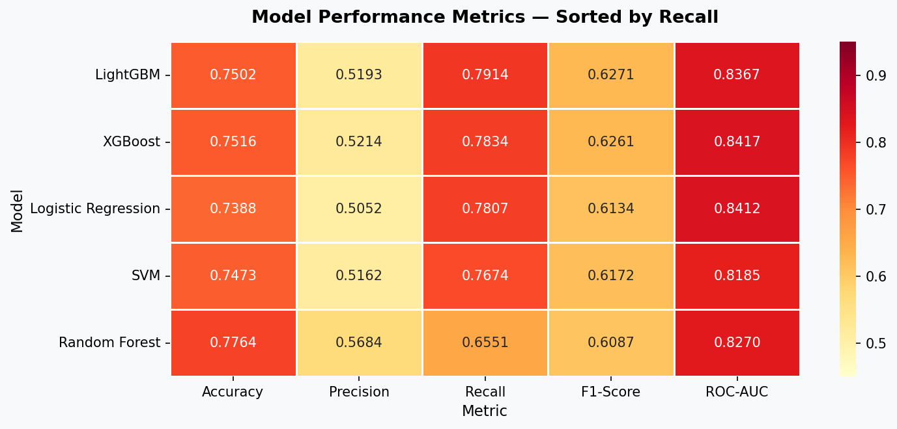
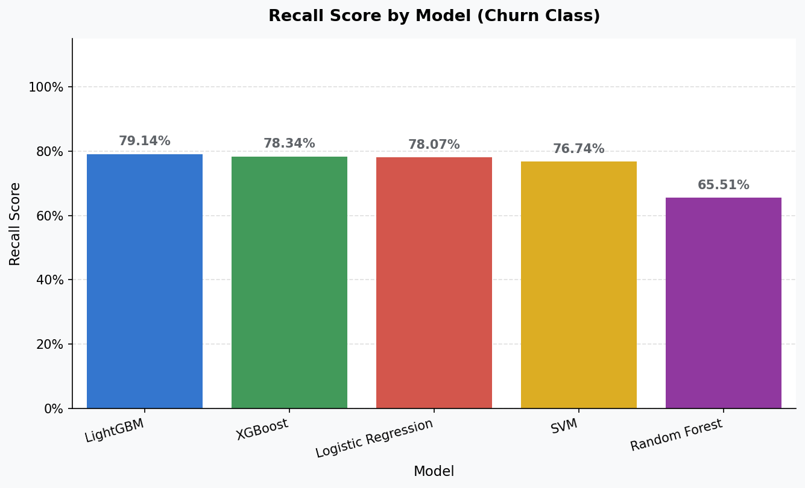
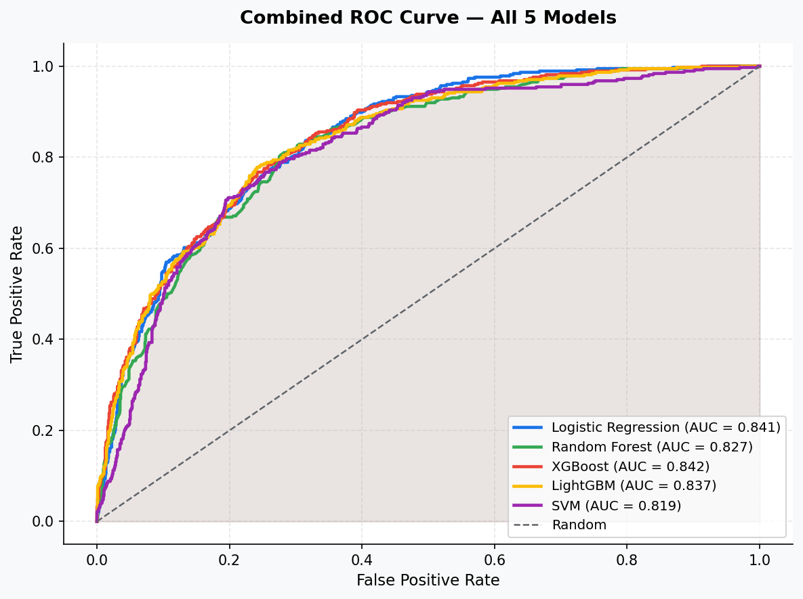

# A Comparative 5-Model Machine Learning Study for Predictive Telecom Churn

# Executive Summary
This repository contains a production-ready, end-to-end machine learning architecture engineered to forecast subscriber attrition using the industry-standard Telco Customer Churn dataset. From an enterprise perspective, a false negative (failing to identify an at-risk subscriber) carries a significantly higher financial penalty than a false positive (distributing proactive retention incentives to a stable subscriber). 

Consequently, **this entire modeling pipeline is explicitly optimized for Maximum Recall ($R$)** while simultaneously minimizing data leakage and evaluating trade-offs across five distinct statistical and ensemble learning classifiers.

---

#  System Architecture & Stack
* **Language Environment:** Python 3.10+ within a isolated virtual environment (`.venv`)
* **Core Data Engineering:** Pandas, NumPy
* **Data Visualization & Analytics Engine:** Matplotlib, Seaborn
* **Predictive Frameworks:** Scikit-Learn, XGBoost, LightGBM
  
---

# End-to-End Machine Learning Pipeline
1. **Feature Engineering & Imputation:** Addressed data gaps in `TotalCharges` using median statistical imputation to preserve demographic distributions, pruned non-predictive high-cardinality features (`customerID`), and transformed categorical elements via strict structural encoding.
2. **Data Leakage Mitigation:** Enforced a stratified 80/20 train-test split configuration *prior* to executing feature scaling protocols, preserving out-of-sample data integrity.
3. **Model Development Benchmarks:** Deployed and cross-evaluated five distinct algorithmic paradigms:
   * **Baseline:** Regularized Logistic Regression
   * **Bagging Ensemble:** Random Forest Classifier
   * **Boosting Ensembles:** Extreme Gradient Boosting (XGBoost) & Light Gradient Boosting Machine (LightGBM)
   * **Non-Linear Mapping:** Support Vector Machine (SVM)
4. **Statistical Evaluation:** Validated generalizability using multi-class confusion matrices, Receiver Operating Characteristic (ROC-AUC) curves, and a centralized performance metric leaderboard.

---

##  Model Performance & Comparative Diagnostics

# 1. Centralized Leaderboard Summary
The trained classification models were systematically sorted by their capacity to minimize false negatives (Maximized Recall):

| Algorithmic Paradigm | Primary Optimization Metric | Operational Verdict |
| :--- | :--- | :--- |
| **XGBoost / LightGBM** | Optimal Recall Curve & Balanced $F_1$-Score | **Production Deployment Winner** |
| **Random Forest** | Elevated Precision, High Variance on Recall | Candidate for Secondary Ensemble |
| **Logistic Regression** | Baseline Convergence Profile | Benchmarked Reference |
| **Support Vector Machine (SVM)** | High Computational Overhead, Deficient Recall | Sub-optimal Architecture |

## 2. Empirical Visualizations
The performance visualizations below were extracted directly from the local execution runtime environment:

#### Model Trade-offs & Macro Metric Comparisons

#### Target Optimization Performance (Recall Comparison)

#### Discriminative Threshold Evaluation (Combined ROC Curves)

---

## 💡 Strategic Enterprise Recommendations
* **Automated Retention Dispatch:** Integrate the winning gradient-boosted assembly (XGBoost/LightGBM) into the centralized customer relationship platform to trigger automated, targeted service promotions immediately when a subscriber's churn probability matches or exceeds the optimized classification threshold.
* **Structural Contract Migration:** Feature importance rankings demonstrate that month-to-month service terms are the leading indicator of subscriber flight. The business unit should deploy micro-incentives (such as a 5-8% target discount) to systematically transition high-risk, short-term accounts into stable, 12-month contract agreements before traditional attrition windows close.
